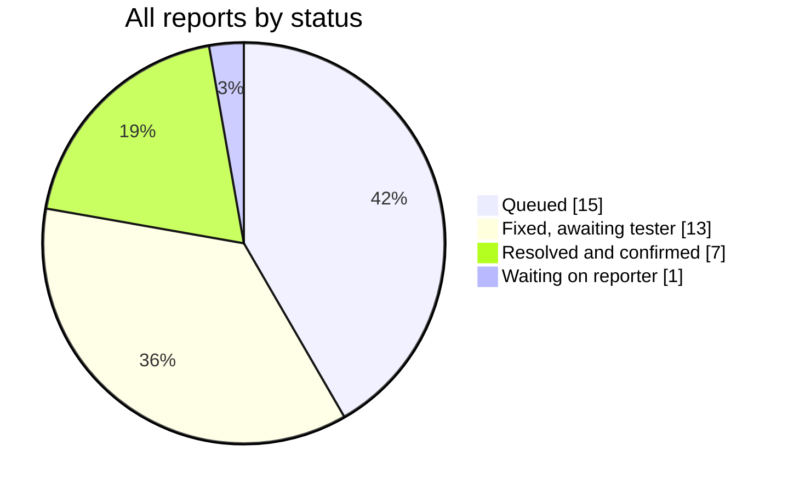
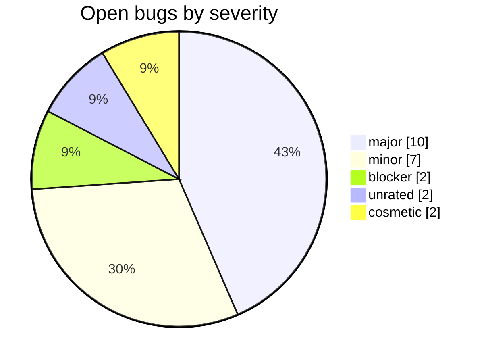
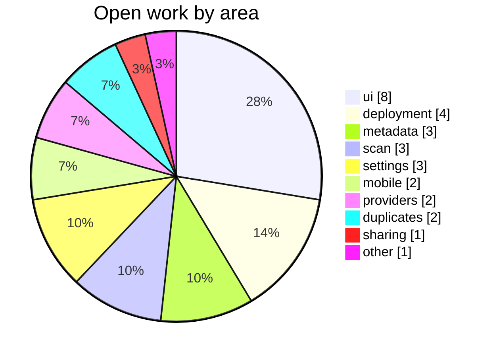

# PMDA — issue tracker

Public bug tracker and feature backlog for **PMDA**, a self-hosted tool for auditing and maintaining messy music libraries.

This repository holds **no source code** — only issues. The code lives in a private repository; access is granted individually. Everything else about the project happens here in the open: what is broken, what is planned, and where each report stands.

<!-- dashboard:start -->
## Progress

`████▓▓▓▓▓▓▓░░░░░░░░░` **19% confirmed fixed** · 56% fixed (incl. awaiting tester confirmation) · 36 reports total

A report counts as *resolved* only when the person who filed it confirms the fix — the dark
segment is finished work, the shaded segment is fixes waiting on their reporter.

<!-- dashboard:end -->

## What PMDA is

PMDA is not a music player, and it is not meant to replace Plex, Plexamp, Navidrome, Jellyfin, beets, Picard, SongKong or Lidarr. The goal is more modest: help you inspect the library behind them.

It currently helps with:

- finding possible duplicate releases
- spotting incomplete albums
- surfacing missing or weak metadata
- showing missing covers
- scanning messy intake folders
- optionally preparing a cleaner destination library

The safest way to try it is read-only first — no deletes or file moves are required.

## Links

- Website and docs — https://pmda.muteq.eu/
- Docker image — https://hub.docker.com/r/meaning/pmda
- Discord — https://discord.gg/2jkwnNhHHR
- Subreddit — https://reddit.com/r/PMDA
- Also available on Unraid Community Applications

## Reporting something

Open an issue here, or post on the Discord or the subreddit — reports from both are collected and filed here automatically, so nothing gets lost either way. If your report already exists, you will be pointed at the existing issue rather than getting a duplicate.

Useful things to include: what you expected, what happened, a screenshot, your PMDA version, and how your library is stored (folder structure, tag quality, compilation handling). Large or messy collections are the interesting cases — old rips, bad tags, multiple editions, bootlegs, live albums, classical, partial downloads.

## How issues are labelled

Every issue carries up to four labels, so the backlog stays readable:

| Axis | Labels |
| --- | --- |
| Type | `bug` · `enhancement` · `question` · `documentation` |
| Area | `area: scan` · `area: metadata` · `area: duplicates` · `area: player` · `area: mobile` · `area: sharing` · `area: settings` · `area: providers` · `area: deployment` · `area: ui` |
| Severity | `severity: blocker` · `severity: major` · `severity: minor` · `severity: cosmetic` |
| Source | `source: discord` · `source: reddit` · `source: both` |

Two more mark a state rather than a category: `needs-info` when a report is waiting on its author, and `fix-shipped` when a fix has been released and is awaiting confirmation. An issue is closed only once the person who reported it confirms it is actually fixed.

PMDA is still early. Bug reports, screenshots, logs, workflow feedback and criticism are all welcome — the point is to find out where it gets things wrong.
