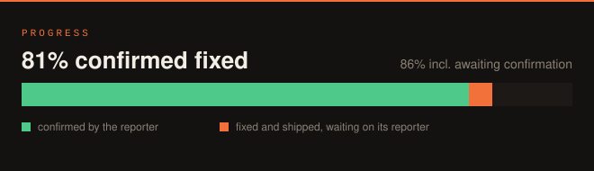
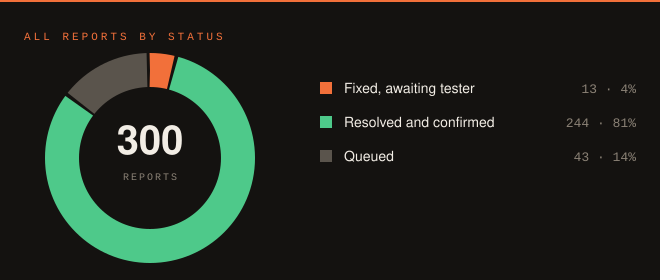
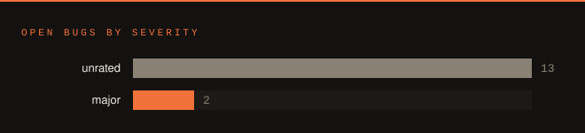
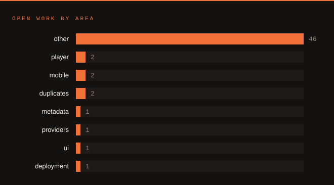

# PMDA — issue tracker

Public bug tracker and feature backlog for **PMDA**, a self-hosted tool for auditing and maintaining messy music libraries.

This repository holds **no source code** — only issues. The code lives in a private repository; access is granted individually. Everything else about the project happens here in the open: what is broken, what is planned, and where each report stands.

<!-- dashboard:start -->
## Where things stand

A report is **resolved** only when the person who filed it confirms the fix — shipped
code waits in orange until its reporter says so. These charts count reports only;
improvements we opened ourselves are tallied separately so they cannot flatter the number.

**Shortcuts** — [ready to test](https://github.com/silkyclouds/pmda-tracker/issues?q=is%3Aissue+is%3Aopen+label%3Aneeds-testing) · [not started](https://github.com/silkyclouds/pmda-tracker/issues?q=is%3Aissue+is%3Aopen+-label%3Aneeds-testing+-label%3Aneeds-info) · [confirmed fixed](https://github.com/silkyclouds/pmda-tracker/issues?q=is%3Aissue+is%3Aclosed)

<!-- dashboard:end -->

<!-- issue-table:start -->
## Every report, one table per area

_217 fixed · 32 open — regenerated automatically. FIXED names the version that shipped it; IN BETA means the fix is on `:beta` awaiting its reporter; BACKLOG is not started._

<b>UI / UX</b> — 45 report(s), 3 open

| # | Issue | Reporter | Status | Fix | Validation |
|---|-------|----------|--------|-----|------------|
| [#162](https://github.com/silkyclouds/pmda-tracker/issues/162) | The Users page belongs under Settings | meaning_1 |  | v420 | Awaiting reporter confirmation |
| [#160](https://github.com/silkyclouds/pmda-tracker/issues/160) | Your circle and Users and shares overlap: keep one listening-activity page | meaning_1 |  | v420 | Awaiting reporter confirmation |
| [#86](https://github.com/silkyclouds/pmda-tracker/issues/86) | Onboarding should scan first, then let the user choose the scope | arty_ai |  | — | — |
| [#234](https://github.com/silkyclouds/pmda-tracker/issues/234) | The 'system' theme option was dropped | silkyclouds |  | v519 | Shipped & closed — reopen welcome |
| [#233](https://github.com/silkyclouds/pmda-tracker/issues/233) | Page titles are not the same size or position from one page to the next | silkyclouds |  | v519 | Shipped & closed — reopen welcome |
| [#231](https://github.com/silkyclouds/pmda-tracker/issues/231) | A suggestion stays on Home after you have acted on it | silkyclouds |  | — | Shipped & closed — reopen welcome |
| [#230](https://github.com/silkyclouds/pmda-tracker/issues/230) | The scan hand-off animation does not look like the scan page | silkyclouds |  | v520 | Shipped & closed — reopen welcome |
| [#229](https://github.com/silkyclouds/pmda-tracker/issues/229) | The audit-mode banner never goes away | silkyclouds |  | — | Shipped & closed — reopen welcome |
| [#219](https://github.com/silkyclouds/pmda-tracker/issues/219) | 'Audit mode' is still called that in several places | silkyclouds |  | — | Shipped & closed — reopen welcome |
| [#215](https://github.com/silkyclouds/pmda-tracker/issues/215) | A brand-new library has an empty Home | silkyclouds |  | v519 | Shipped & closed — reopen welcome |
| [#212](https://github.com/silkyclouds/pmda-tracker/issues/212) | The editorial typeface has never actually been loaded | silkyclouds |  | — | Shipped & closed — reopen welcome |
| [#206](https://github.com/silkyclouds/pmda-tracker/issues/206) | Notification about folders outside the library shelves was unreadable | silkyclouds |  | v515 | Shipped & closed — reopen welcome |
| [#201](https://github.com/silkyclouds/pmda-tracker/issues/201) | Library lists were permanently served by a stale fallback, so label logos and descriptions ne… | silkyclouds |  | v513 | Shipped & closed — reopen welcome |
| [#198](https://github.com/silkyclouds/pmda-tracker/issues/198) | Wizard animations: sequences that died silently or showed invented numbers | silkyclouds |  | v515 | Shipped & closed — reopen welcome |
| [#180](https://github.com/silkyclouds/pmda-tracker/issues/180) | Incompletes page reports zero flagged albums: one binary cell makes the whole response unseri… | ovizii |  | v429 | Shipped & closed — reopen welcome |
| [#165](https://github.com/silkyclouds/pmda-tracker/issues/165) | Library header counts disagree with Statistics, and the size on disk looks wrong | meaning_1 |  | v506 | Shipped & closed — reopen welcome |
| [#164](https://github.com/silkyclouds/pmda-tracker/issues/164) | The startup splash quote is not italic like every other standfirst | meaning_1 |  | v412 | Shipped & closed — reopen welcome |
| [#161](https://github.com/silkyclouds/pmda-tracker/issues/161) | Tools page is mostly redundant with pages that already exist | meaning_1 |  | v412 | Shipped & closed — reopen welcome |
| [#158](https://github.com/silkyclouds/pmda-tracker/issues/158) | Requests page: albums already in the library are not clickable | meaning_1 |  | v412 | Shipped & closed — reopen welcome |
| [#157](https://github.com/silkyclouds/pmda-tracker/issues/157) | Identify step headline hijacked by per-artist index refreshes (0 of 0 folders, then 1 of 2) | meaning_1 |  | v401 | Shipped & closed — reopen welcome |
| [#156](https://github.com/silkyclouds/pmda-tracker/issues/156) | Light theme: hovered rows in quick-search suggestions turn white and become invisible | meaning_1 |  | v400 | Shipped & closed — reopen welcome |
| [#154](https://github.com/silkyclouds/pmda-tracker/issues/154) | Every duplicates number must name its scope (sidebar 0 vs fine-check 632 vs top bar 631) | ovizii |  | v396 | Shipped & closed — reopen welcome |
| [#150](https://github.com/silkyclouds/pmda-tracker/issues/150) | Edition review modal: a single glued to its parent album offers only KEEP/DELETE — no way to … | Hodel1 |  | v399 | Shipped & closed — reopen welcome |
| [#149](https://github.com/silkyclouds/pmda-tracker/issues/149) | Workers panel: provider states and icon grid need a legend, and busy/idle accounting disagree… | ovizii |  | v391 | Shipped & closed — reopen welcome |
| [#148](https://github.com/silkyclouds/pmda-tracker/issues/148) | Broken-album review showed a 'Run AI shadow' button with no explanation (removed) | ovizii |  | — | Shipped & closed — reopen welcome |
| [#146](https://github.com/silkyclouds/pmda-tracker/issues/146) | Scan card step count grows mid-run: 'Step 4 of 4' becomes 'of 5' when enrichment starts | meaning_1 |  | v389 | Shipped & closed — reopen welcome |
| [#92](https://github.com/silkyclouds/pmda-tracker/issues/92) | Library export label is truncated, and its relationship to the Export stage is unclear | ovizii |  | v392 | Shipped & closed — reopen welcome |
| [#89](https://github.com/silkyclouds/pmda-tracker/issues/89) | Nothing says which features stay inert until the first scan finalizes | edith1775 |  | v396 | Shipped & closed — reopen welcome |
| [#88](https://github.com/silkyclouds/pmda-tracker/issues/88) | Scan History: a resumed scan looks like a string of short failed runs | ovizii |  | v391 | Shipped & closed — reopen welcome |
| [#84](https://github.com/silkyclouds/pmda-tracker/issues/84) | Heart and Like do the same thing: pick one, or make the rating model explicit | bitsofbitsofbits |  | 1.0.5 | Shipped & closed — reopen welcome |
| [#79](https://github.com/silkyclouds/pmda-tracker/issues/79) | Scan vocabulary is undocumented: SKIPPED, FLAGGED, SOFT_MATCH, Files-safe, live index, backlog | ovizii |  | — | Shipped & closed — reopen welcome |
| [#77](https://github.com/silkyclouds/pmda-tracker/issues/77) | Artwork cache: missing .webp raises a traceback mid-scan | ovizii |  | v399 | Shipped & closed — reopen welcome |
| [#48](https://github.com/silkyclouds/pmda-tracker/issues/48) | Search results: play a track directly from the results page | cissoubaka |  | v398 | Shipped & closed — reopen welcome |
| [#45](https://github.com/silkyclouds/pmda-tracker/issues/45) | Statistics: library size on disk and total playtime (years/months/days/hours) | meaning_1 |  | v398 | Shipped & closed — reopen welcome |
| [#41](https://github.com/silkyclouds/pmda-tracker/issues/41) | No version number anywhere in the product — testers cannot tell which build they are on | cissoubaka, foggymtndrifter |  | v345 | Shipped & closed — reopen welcome |
| [#39](https://github.com/silkyclouds/pmda-tracker/issues/39) | Concerts: process newly added artists/genres against providers immediately | meaning_1 |  | v396 | Shipped & closed — reopen welcome |
| [#37](https://github.com/silkyclouds/pmda-tracker/issues/37) | Liked page caps at 96 songs while all likes are stored | foggymtndrifter |  | v396 | Shipped & closed — reopen welcome |
| [#29](https://github.com/silkyclouds/pmda-tracker/issues/29) | After an update the library reads 0 artists / 0 albums with no explanation | silkyclouds |  | v396 | Shipped & closed — reopen welcome |
| [#22](https://github.com/silkyclouds/pmda-tracker/issues/22) | PMDA advertises "no AI" but shows AI prompts and an AI health row | ovizii |  | v391 | Shipped & closed — reopen welcome |
| [#17](https://github.com/silkyclouds/pmda-tracker/issues/17) | Backend logs are unreadable in light mode | lewis91 |  | v396 | Shipped & closed — reopen welcome |
| [#16](https://github.com/silkyclouds/pmda-tracker/issues/16) | Not enough padding between the Library heading and THE COLLECTION line | lewis91 |  | v396 | Shipped & closed — reopen welcome |
| [#14](https://github.com/silkyclouds/pmda-tracker/issues/14) | A popup flashes on screen for a split second when PMDA loads | lewis91 |  | v396 | Shipped & closed — reopen welcome |
| [#13](https://github.com/silkyclouds/pmda-tracker/issues/13) | Player bar covers the bottom of Search results and Tools | lewis91 |  | v396 | Shipped & closed — reopen welcome |
| [#11](https://github.com/silkyclouds/pmda-tracker/issues/11) | Right half of the tile size slider on the Artists page does nothing | lewis91 |  | v345 | Shipped & closed — reopen welcome |
| [#9](https://github.com/silkyclouds/pmda-tracker/issues/9) | Opening History before any scan has run shows a 404 page | lewis91 |  | v345 | Shipped & closed — reopen welcome |

<b>Scanner & pipeline</b> — 48 report(s), 1 open

| # | Issue | Reporter | Status | Fix | Validation |
|---|-------|----------|--------|-----|------------|
| [#98](https://github.com/silkyclouds/pmda-tracker/issues/98) | SQLite 'database is locked' raises a traceback mid-scan instead of retrying | silkyclouds |  | — | — |
| [#217](https://github.com/silkyclouds/pmda-tracker/issues/217) | The first scan no longer chains the improvement pass | silkyclouds |  | — | Shipped & closed — reopen welcome |
| [#214](https://github.com/silkyclouds/pmda-tracker/issues/214) | The scan flags albums as incomplete that the review page then discards | silkyclouds |  | v519 | Shipped & closed — reopen welcome |
| [#213](https://github.com/silkyclouds/pmda-tracker/issues/213) | The scan report contradicts itself | silkyclouds |  | v519 | Shipped & closed — reopen welcome |
| [#205](https://github.com/silkyclouds/pmda-tracker/issues/205) | Scan report still described AI steps that no longer exist in PMDA | silkyclouds |  | v515 | Shipped & closed — reopen welcome |
| [#200](https://github.com/silkyclouds/pmda-tracker/issues/200) | Incomplete albums: albums still arriving in an intake folder were flagged as incomplete | silkyclouds |  | v515 | Shipped & closed — reopen welcome |
| [#181](https://github.com/silkyclouds/pmda-tracker/issues/181) | A scan's tuple can be written into broken_albums with its columns shifted | silkyclouds |  | — | Shipped & closed — reopen welcome |
| [#175](https://github.com/silkyclouds/pmda-tracker/issues/175) | Library index rebuild restarts from zero on every interruption, and re-reads folders that nev… | meaning_1 |  | — | Shipped & closed — reopen welcome |
| [#145](https://github.com/silkyclouds/pmda-tracker/issues/145) | Finalize export pace is bounded by per-album bookkeeping, not I/O | meaning_1 |  | v401 | Shipped & closed — reopen welcome |
| [#137](https://github.com/silkyclouds/pmda-tracker/issues/137) | A scan in its preparation phases reports zero progress on every surface, and reads as hung | meaning_1 |  | v387 | Shipped & closed — reopen welcome |
| [#136](https://github.com/silkyclouds/pmda-tracker/issues/136) | Startup resume has been silently dead: reconciliation clears the exact status the picker requ… | meaning_1 |  | v387 | Shipped & closed — reopen welcome |
| [#105](https://github.com/silkyclouds/pmda-tracker/issues/105) | A full scan silently resumes a partial plan and reports it as the total | silkyclouds |  | v333 | Shipped & closed — reopen welcome |
| [#97](https://github.com/silkyclouds/pmda-tracker/issues/97) | Full scan segfaults on a large library, four seconds into filesystem discovery | silkyclouds |  | v350 | Shipped & closed — reopen welcome |
| [#96](https://github.com/silkyclouds/pmda-tracker/issues/96) | Stale pipeline job is flagged but never cleared: library_index stuck for 8.8 hours | silkyclouds |  | v339 | Shipped & closed — reopen welcome |
| [#95](https://github.com/silkyclouds/pmda-tracker/issues/95) | Scan emits no heartbeat during filesystem discovery, so a healthy scan looks stalled | silkyclouds |  | v335 | Shipped & closed — reopen welcome |
| [#82](https://github.com/silkyclouds/pmda-tracker/issues/82) | [scanner] One pacer for MusicBrainz, not two | silkyclouds |  | — | Shipped & closed — reopen welcome |
| [#81](https://github.com/silkyclouds/pmda-tracker/issues/81) | [scanner] Only look up a table of contents when the folder came off a disc | silkyclouds |  | — | Shipped & closed — reopen welcome |
| [#78](https://github.com/silkyclouds/pmda-tracker/issues/78) | Incomplete albums: the scan count and the review queue disagree | ovizii |  | v496 | Shipped & closed — reopen welcome |
| [#76](https://github.com/silkyclouds/pmda-tracker/issues/76) | [scanner] Wire every improvement into the live pipeline | silkyclouds |  | — | Shipped & closed — reopen welcome |
| [#75](https://github.com/silkyclouds/pmda-tracker/issues/75) | [scanner] Install the MusicBrainz call discipline on every call site | silkyclouds |  | — | Shipped & closed — reopen welcome |
| [#73](https://github.com/silkyclouds/pmda-tracker/issues/73) | [scanner] Key classical identity on the performance, not the work | silkyclouds |  | — | Shipped & closed — reopen welcome |
| [#72](https://github.com/silkyclouds/pmda-tracker/issues/72) | [scanner] Batch the Postgres writes instead of one round trip per row | silkyclouds |  | — | Shipped & closed — reopen welcome |
| [#71](https://github.com/silkyclouds/pmda-tracker/issues/71) | [scanner] Narrow the provider query rather than widening the results | silkyclouds |  | — | Shipped & closed — reopen welcome |
| [#69](https://github.com/silkyclouds/pmda-tracker/issues/69) | [scanner] Wire AcoustID escalation into the scan pipeline | silkyclouds |  | — | Shipped & closed — reopen welcome |
| [#68](https://github.com/silkyclouds/pmda-tracker/issues/68) | [scanner] Optimal track alignment instead of greedy pairing | silkyclouds |  | — | Shipped & closed — reopen welcome |
| [#67](https://github.com/silkyclouds/pmda-tracker/issues/67) | [scanner] Various Artists inferred at a dominance threshold | silkyclouds |  | — | Shipped & closed — reopen welcome |
| [#66](https://github.com/silkyclouds/pmda-tracker/issues/66) | [scanner] Album identity derived from content, not from the path | silkyclouds |  | — | Shipped & closed — reopen welcome |
| [#65](https://github.com/silkyclouds/pmda-tracker/issues/65) | [scanner] Per-folder manifest hash for incremental scans | silkyclouds |  | — | Shipped & closed — reopen welcome |
| [#64](https://github.com/silkyclouds/pmda-tracker/issues/64) | [scanner] Tag-based grouping cross-checked against folder grouping | silkyclouds |  | — | Shipped & closed — reopen welcome |
| [#63](https://github.com/silkyclouds/pmda-tracker/issues/63) | [scanner] Album-aware keeper cascade for duplicates | silkyclouds |  | — | Shipped & closed — reopen welcome |
| [#62](https://github.com/silkyclouds/pmda-tracker/issues/62) | [scanner] Call discipline for the public MusicBrainz web service | silkyclouds |  | — | Shipped & closed — reopen welcome |
| [#61](https://github.com/silkyclouds/pmda-tracker/issues/61) | [scanner] Fuzzy MusicBrainz TOC lookup identifies the exact release | silkyclouds |  | — | Shipped & closed — reopen welcome |
| [#60](https://github.com/silkyclouds/pmda-tracker/issues/60) | [scanner] AcoustID escalation with album-level consensus | silkyclouds |  | — | Shipped & closed — reopen welcome |
| [#59](https://github.com/silkyclouds/pmda-tracker/issues/59) | [scanner] Rip evidence from cue sheets and EAC/XLD logs | silkyclouds |  | — | Shipped & closed — reopen welcome |
| [#58](https://github.com/silkyclouds/pmda-tracker/issues/58) | [scanner] Three provider outcomes, circuit breaker and token bucket | silkyclouds |  | — | Shipped & closed — reopen welcome |
| [#57](https://github.com/silkyclouds/pmda-tracker/issues/57) | [scanner] Match distance with per-penalty veto and runner-up margin | silkyclouds |  | — | Shipped & closed — reopen welcome |
| [#56](https://github.com/silkyclouds/pmda-tracker/issues/56) | [scanner] Audio identity: stream hash and duration vector | silkyclouds |  | — | Shipped & closed — reopen welcome |
| [#55](https://github.com/silkyclouds/pmda-tracker/issues/55) | [scanner] Classical completeness judged by work structure, not file count | silkyclouds |  | — | Shipped & closed — reopen welcome |
| [#54](https://github.com/silkyclouds/pmda-tracker/issues/54) | [scanner] Detect albums truncated at the tail | silkyclouds |  | — | Shipped & closed — reopen welcome |
| [#52](https://github.com/silkyclouds/pmda-tracker/issues/52) | [scanner] Scan worker width raised to match provider-first | silkyclouds |  | — | Shipped & closed — reopen welcome |
| [#51](https://github.com/silkyclouds/pmda-tracker/issues/51) | [scanner] MusicBrainz quarantine per release group | silkyclouds |  | — | Shipped & closed — reopen welcome |
| [#50](https://github.com/silkyclouds/pmda-tracker/issues/50) | [scanner] Watchdog for zombie scan jobs | silkyclouds |  | — | Shipped & closed — reopen welcome |
| [#49](https://github.com/silkyclouds/pmda-tracker/issues/49) | [scanner] Post-scan export no longer re-runs discovery | silkyclouds |  | — | Shipped & closed — reopen welcome |
| [#47](https://github.com/silkyclouds/pmda-tracker/issues/47) | Scan roots: three competing sources of truth, and Settings changes can be silently ignored | silkyclouds |  | v391 | Shipped & closed — reopen welcome |
| [#32](https://github.com/silkyclouds/pmda-tracker/issues/32) | Identify with providers first, MusicBrainz asynchronously after | silkyclouds |  | v301 | Shipped & closed — reopen welcome |
| [#7](https://github.com/silkyclouds/pmda-tracker/issues/7) | Scanning is extremely slow — over a week for 100k tracks | lewis91 |  | v396 | Shipped & closed — reopen welcome |
| [#6](https://github.com/silkyclouds/pmda-tracker/issues/6) | FutureTimeout - Export failed | Hodel1 |  | v396 | Shipped & closed — reopen welcome |
| [#1](https://github.com/silkyclouds/pmda-tracker/issues/1) | Stuck with error on first album | silkyclouds |  | — | Shipped & closed — reopen welcome |

<b>Duplicates</b> — 5 report(s), 0 open

| # | Issue | Reporter | Status | Fix | Validation |
|---|-------|----------|--------|-----|------------|
| [#174](https://github.com/silkyclouds/pmda-tracker/issues/174) | The duplicates page served 13 groups while the store held 6,805 | silkyclouds |  | v494 | Shipped & closed — reopen welcome |
| [#104](https://github.com/silkyclouds/pmda-tracker/issues/104) | Duplicate keeper drops the copy that has cover art | silkyclouds |  | — | Shipped & closed — reopen welcome |
| [#103](https://github.com/silkyclouds/pmda-tracker/issues/103) | Export arbitration quarantines a split album's tail as a duplicate loser | silkyclouds |  | — | Shipped & closed — reopen welcome |
| [#15](https://github.com/silkyclouds/pmda-tracker/issues/15) | Duplicate detection calls different editions an exact duplicate | lewis91 |  | v396 | Shipped & closed — reopen welcome |
| [#12](https://github.com/silkyclouds/pmda-tracker/issues/12) | Sidebar reports duplicates found, but the Duplicates page is empty | edith1775, lewis91 |  | v418 | Shipped & closed — reopen welcome |

<b>Metadata & matching</b> — 18 report(s), 1 open

| # | Issue | Reporter | Status | Fix | Validation |
|---|-------|----------|--------|-----|------------|
| [#183](https://github.com/silkyclouds/pmda-tracker/issues/183) | Match vocabulary: edition / matched / tags-only, instead of hardmatched and softmatched | silkyclouds |  | v449 | Awaiting reporter confirmation |
| [#203](https://github.com/silkyclouds/pmda-tracker/issues/203) | Descriptions and provider catalogues lived only in a volatile cache and were refetched forever | silkyclouds |  | v514 | Shipped & closed — reopen welcome |
| [#202](https://github.com/silkyclouds/pmda-tracker/issues/202) | Label pages could show an article about the wrong thing entirely | silkyclouds |  | v513 | Shipped & closed — reopen welcome |
| [#173](https://github.com/silkyclouds/pmda-tracker/issues/173) | A one-track folder could earn a permanent strict match on a similar title alone | silkyclouds |  | v415 | Shipped & closed — reopen welcome |
| [#172](https://github.com/silkyclouds/pmda-tracker/issues/172) | Track sizes and durations are overwritten with zero by a partial re-upsert, so size on disk a… | silkyclouds |  | v414 | Shipped & closed — reopen welcome |
| [#166](https://github.com/silkyclouds/pmda-tracker/issues/166) | The background match re-verification is invisible on the Enrichment page | meaning_1 |  | v412 | Shipped & closed — reopen welcome |
| [#159](https://github.com/silkyclouds/pmda-tracker/issues/159) | Likes should drive the concert calendar automatically | meaning_1 |  | v547 | Shipped & closed — reopen welcome |
| [#144](https://github.com/silkyclouds/pmda-tracker/issues/144) | A persistent needs_ai_review quality flag on profiles, set at ingestion and queryable via MCP | meaning_1 |  | v388 | Shipped & closed — reopen welcome |
| [#143](https://github.com/silkyclouds/pmda-tracker/issues/143) | Artist bios assigned to the wrong entity when scraping resolves a homonym | meaning_1 |  | v388 | Shipped & closed — reopen welcome |
| [#142](https://github.com/silkyclouds/pmda-tracker/issues/142) | About 12,500 curator profile rows are empty placeholders that mask albums from missing-descri… | meaning_1 |  | v388 | Shipped & closed — reopen welcome |
| [#141](https://github.com/silkyclouds/pmda-tracker/issues/141) | Curator ingestion stores full tracklists, sometimes with lyrics, as the album description | meaning_1 |  | v388 | Shipped & closed — reopen welcome |
| [#138](https://github.com/silkyclouds/pmda-tracker/issues/138) | MusicBrainz provider shows error: release-group lookups 404 on the mirror for ids the public … | meaning_1 |  | v388 | Shipped & closed — reopen welcome |
| [#101](https://github.com/silkyclouds/pmda-tracker/issues/101) | No way to match an album by hand when automatic matching fails | bitsofbitsofbits |  | v404 | Shipped & closed — reopen welcome |
| [#99](https://github.com/silkyclouds/pmda-tracker/issues/99) | Track titles that start with a number lose it: "100 Bad Days" becomes "Bad Days" | bitsofbitsofbits |  | v396 | Shipped & closed — reopen welcome |
| [#90](https://github.com/silkyclouds/pmda-tracker/issues/90) | Albums silently un-match when MusicBrainz deletes the release they matched | iecj |  | v404 | Shipped & closed — reopen welcome |
| [#34](https://github.com/silkyclouds/pmda-tracker/issues/34) | Unmatchable folder names (abbreviated compilations): automatic AcoustID / OCR escalation | cissoubaka |  | v407 | Shipped & closed — reopen welcome |
| [#26](https://github.com/silkyclouds/pmda-tracker/issues/26) | Matching fails on a large share of the library | bitsofbitsofbits |  | v302 | Shipped & closed — reopen welcome |
| [#10](https://github.com/silkyclouds/pmda-tracker/issues/10) | Artist names containing '&' are split, and the albums land on the wrong artist | lewis91 |  | v396 | Shipped & closed — reopen welcome |

<b>Mobile apps</b> — 6 report(s), 0 open

| # | Issue | Reporter | Status | Fix | Validation |
|---|-------|----------|--------|-----|------------|
| [#225](https://github.com/silkyclouds/pmda-tracker/issues/225) | The mobile device-link step disappeared from the personal setup | silkyclouds |  | — | Shipped & closed — reopen welcome |
| [#94](https://github.com/silkyclouds/pmda-tracker/issues/94) | No documented route into the Android beta | foggymtndrifter |  | — | Shipped & closed — reopen welcome |
| [#44](https://github.com/silkyclouds/pmda-tracker/issues/44) | Android app: Liked music list has no play or shuffle button | foggymtndrifter |  | 1.0.4 | Shipped & closed — reopen welcome |
| [#43](https://github.com/silkyclouds/pmda-tracker/issues/43) | Android app: no Download button on playlists | foggymtndrifter |  | 1.0.4 | Shipped & closed — reopen welcome |
| [#36](https://github.com/silkyclouds/pmda-tracker/issues/36) | Android app: proper offline support (cached lists, offline filtering) | foggymtndrifter |  | 1.0.5 | Shipped & closed — reopen welcome |
| [#35](https://github.com/silkyclouds/pmda-tracker/issues/35) | Mobile apps cannot log in when MFA is enabled | iecj |  | 1.0.4 | Shipped & closed — reopen welcome |

<b>Player & playback</b> — 1 report(s), 0 open

| # | Issue | Reporter | Status | Fix | Validation |
|---|-------|----------|--------|-----|------------|
| [#83](https://github.com/silkyclouds/pmda-tracker/issues/83) | Web player stays at 0:00 on some albums while the mobile app plays them | bitsofbitsofbits |  | v401 | Shipped & closed — reopen welcome |

<b>Providers & integrations</b> — 6 report(s), 0 open

| # | Issue | Reporter | Status | Fix | Validation |
|---|-------|----------|--------|-----|------------|
| [#232](https://github.com/silkyclouds/pmda-tracker/issues/232) | AudioMuse detection is only surfaced on Home, not during setup | silkyclouds |  | — | Shipped & closed — reopen welcome |
| [#204](https://github.com/silkyclouds/pmda-tracker/issues/204) | AudioMuse: PMDA becomes the single interface for sonic discovery | silkyclouds |  | v515 | Shipped & closed — reopen welcome |
| [#140](https://github.com/silkyclouds/pmda-tracker/issues/140) | Last.fm bios keep the Creative Commons boilerplate and arrive unformatted | meaning_1 |  | v388 | Shipped & closed — reopen welcome |
| [#139](https://github.com/silkyclouds/pmda-tracker/issues/139) | Discogs pressing notes are stored as the album review | meaning_1 |  | v388 | Shipped & closed — reopen welcome |
| [#19](https://github.com/silkyclouds/pmda-tracker/issues/19) | Incompletes page says acquisition is disabled although Lidarr is configured and on | foggymtndrifter |  | v396 | Shipped & closed — reopen welcome |
| [#18](https://github.com/silkyclouds/pmda-tracker/issues/18) | Spotify setup shows a redirect URI that PMDA never actually sends | bitsofbitsofbits, foggymtndrifter |  | v396 | Shipped & closed — reopen welcome |

<b>Settings & onboarding</b> — 29 report(s), 0 open

| # | Issue | Reporter | Status | Fix | Validation |
|---|-------|----------|--------|-----|------------|
| [#235](https://github.com/silkyclouds/pmda-tracker/issues/235) | Dead onboarding endpoints remain in the backend | silkyclouds |  | v519 | Shipped & closed — reopen welcome |
| [#228](https://github.com/silkyclouds/pmda-tracker/issues/228) | Suggestion lists can be permanently empty while the first scan runs | silkyclouds |  | v520 | Shipped & closed — reopen welcome |
| [#227](https://github.com/silkyclouds/pmda-tracker/issues/227) | Reloading the page during setup loses every answer | silkyclouds |  | v520 | Shipped & closed — reopen welcome |
| [#224](https://github.com/silkyclouds/pmda-tracker/issues/224) | The avatar step disappeared from the personal setup | silkyclouds |  | — | Shipped & closed — reopen welcome |
| [#223](https://github.com/silkyclouds/pmda-tracker/issues/223) | The weekly digest step disappeared from the personal setup | silkyclouds |  | — | Shipped & closed — reopen welcome |
| [#220](https://github.com/silkyclouds/pmda-tracker/issues/220) | Two-factor is offered to administrators only | silkyclouds |  | — | Shipped & closed — reopen welcome |
| [#218](https://github.com/silkyclouds/pmda-tracker/issues/218) | Finish validating the personal setup flow end to end | silkyclouds |  | v520 | Shipped & closed — reopen welcome |
| [#216](https://github.com/silkyclouds/pmda-tracker/issues/216) | Two user setup flows are mounted at the same time | silkyclouds |  | v519 | Shipped & closed — reopen welcome |
| [#211](https://github.com/silkyclouds/pmda-tracker/issues/211) | Taste step: pick genres, then artists, and let the list grow from artists you already picked | silkyclouds |  | — | Shipped & closed — reopen welcome |
| [#210](https://github.com/silkyclouds/pmda-tracker/issues/210) | The old taste modal keeps reopening after the new setup is finished | silkyclouds |  | — | Shipped & closed — reopen welcome |
| [#209](https://github.com/silkyclouds/pmda-tracker/issues/209) | Music taste can only be chosen by someone who says yes to concerts | silkyclouds |  | — | Shipped & closed — reopen welcome |
| [#208](https://github.com/silkyclouds/pmda-tracker/issues/208) | Onboarding taste picks never reach the features that were built to use them | silkyclouds |  | — | Shipped & closed — reopen welcome |
| [#207](https://github.com/silkyclouds/pmda-tracker/issues/207) | Settings spoke a different language than the setup wizard | silkyclouds |  | v515 | Shipped & closed — reopen welcome |
| [#199](https://github.com/silkyclouds/pmda-tracker/issues/199) | Self-check: tell the user the exact line to add, and never claim a folder is writable when it… | silkyclouds |  | v515 | Shipped & closed — reopen welcome |
| [#197](https://github.com/silkyclouds/pmda-tracker/issues/197) | Wizard: several steps promised an action and performed none | silkyclouds |  | v515 | Shipped & closed — reopen welcome |
| [#196](https://github.com/silkyclouds/pmda-tracker/issues/196) | Wizard: settings collected in the wizard were silently dropped or written as placeholder text | silkyclouds |  | v515 | Shipped & closed — reopen welcome |
| [#195](https://github.com/silkyclouds/pmda-tracker/issues/195) | Setup wizard: one scenario-driven flow replaces the splash and the old admin wizard | silkyclouds |  | v515 | Shipped & closed — reopen welcome |
| [#163](https://github.com/silkyclouds/pmda-tracker/issues/163) | Removing a shared library needs a confirmation and must disappear immediately | meaning_1 |  | v412 | Shipped & closed — reopen welcome |
| [#102](https://github.com/silkyclouds/pmda-tracker/issues/102) | Setting up the AI integrations is enough friction that testers give up | bitsofbitsofbits |  | — | Shipped & closed — reopen welcome |
| [#100](https://github.com/silkyclouds/pmda-tracker/issues/100) | Reset PMDA returns a 400 and does nothing | bitsofbitsofbits |  | v396 | Shipped & closed — reopen welcome |
| [#91](https://github.com/silkyclouds/pmda-tracker/issues/91) | Database-only mode, with an opt-in write-through to files | iecj |  | v408 | Shipped & closed — reopen welcome |
| [#85](https://github.com/silkyclouds/pmda-tracker/issues/85) | No dry-run mode: nothing lets a user see what PMDA would do before it does it | arty_ai |  | — | Shipped & closed — reopen welcome |
| [#80](https://github.com/silkyclouds/pmda-tracker/issues/80) | Web searches during scan are not disclosed or configurable | ovizii |  | v391 | Shipped & closed — reopen welcome |
| [#74](https://github.com/silkyclouds/pmda-tracker/issues/74) | [scanner] Report which item the scan is on, not just how far along | silkyclouds |  | — | Shipped & closed — reopen welcome |
| [#53](https://github.com/silkyclouds/pmda-tracker/issues/53) | [scanner] Self-hosted error telemetry, strictly opt-in | silkyclouds |  | — | Shipped & closed — reopen welcome |
| [#46](https://github.com/silkyclouds/pmda-tracker/issues/46) | MCP: like artists, genres and labels through the PMDA MCP server | meaning_1 |  | v398 | Shipped & closed — reopen welcome |
| [#25](https://github.com/silkyclouds/pmda-tracker/issues/25) | Worker count and batch size display 0 while a manual override is still active | ovizii |  | v396 | Shipped & closed — reopen welcome |
| [#20](https://github.com/silkyclouds/pmda-tracker/issues/20) | Spotify Client ID has to be set as a Docker variable, but the docs point at the UI | bitsofbitsofbits, foggymtndrifter |  | v396 | Shipped & closed — reopen welcome |
| [#8](https://github.com/silkyclouds/pmda-tracker/issues/8) | Onboarding asks only for the Last.fm API key, settings also asks for the secret | lewis91 |  | v396 | Shipped & closed — reopen welcome |

<b>Deployment & docs</b> — 19 report(s), 3 open

| # | Issue | Reporter | Status | Fix | Validation |
|---|-------|----------|--------|-----|------------|
| [#184](https://github.com/silkyclouds/pmda-tracker/issues/184) | Why PostgreSQL? Measured, on a library big enough to hurt | silkyclouds |  | — | — |
| [#179](https://github.com/silkyclouds/pmda-tracker/issues/179) | One-click MusicBrainz mirror: proven end to end, after two bugs that made it impossible | bitsofbitsofbits, iecj, mushm0uth |  | v431 | Awaiting reporter confirmation |
| [#33](https://github.com/silkyclouds/pmda-tracker/issues/33) | Legacy cleanup campaign: dead modes, dead vars, dead log lines, monolith factoring, security … | silkyclouds |  | — | — |
| [#226](https://github.com/silkyclouds/pmda-tracker/issues/226) | The public address of the server has no step anywhere | silkyclouds |  | v520 | Shipped & closed — reopen welcome |
| [#93](https://github.com/silkyclouds/pmda-tracker/issues/93) | Document whether PMDA and Jellyfin can share one music library | bitsofbitsofbits |  | — | Shipped & closed — reopen welcome |
| [#87](https://github.com/silkyclouds/pmda-tracker/issues/87) | Cache layers are undocumented: which paths want NVMe, and how much each will consume | ovizii |  | — | Shipped & closed — reopen welcome |
| [#70](https://github.com/silkyclouds/pmda-tracker/issues/70) | [scanner] Test container disk leak filled the Docker pool | silkyclouds |  | — | Shipped & closed — reopen welcome |
| [#42](https://github.com/silkyclouds/pmda-tracker/issues/42) | Beta instructions point testers at :latest, but the fixes ship on :beta | foggymtndrifter |  | v388 | Shipped & closed — reopen welcome |
| [#40](https://github.com/silkyclouds/pmda-tracker/issues/40) | Unraid reuses the cached image when switching to :beta — testers test the old build believing… | foggymtndrifter |  | v388 | Shipped & closed — reopen welcome |
| [#38](https://github.com/silkyclouds/pmda-tracker/issues/38) | OOM crashes during first big scan (4G container limit) | ovizii |  | v388 | Shipped & closed — reopen welcome |
| [#28](https://github.com/silkyclouds/pmda-tracker/issues/28) | Lost web UI access after updating | silkyclouds |  | — | Shipped & closed — reopen welcome |
| [#27](https://github.com/silkyclouds/pmda-tracker/issues/27) | Ollama is not detected when it runs in the same Docker stack | silkyclouds |  | — | Shipped & closed — reopen welcome |
| [#24](https://github.com/silkyclouds/pmda-tracker/issues/24) | Container CPU limit ignored — PMDA sizes itself from the host's CPU count | ovizii |  | v388 | Shipped & closed — reopen welcome |
| [#23](https://github.com/silkyclouds/pmda-tracker/issues/23) | Repeated PostgreSQL error: relation "files_albums" does not exist | ovizii |  | v396 | Shipped & closed — reopen welcome |
| [#21](https://github.com/silkyclouds/pmda-tracker/issues/21) | Bootstrap is refused over Tailscale — 100.x addresses are treated as public | ovizii |  | v396 | Shipped & closed — reopen welcome |
| [#5](https://github.com/silkyclouds/pmda-tracker/issues/5) | UnRAID 7.1.2 inability to create PMDA docker container from default settings related to confi… | silkyclouds |  | — | Shipped & closed — reopen welcome |
| [#4](https://github.com/silkyclouds/pmda-tracker/issues/4) | KeyError 'Missing required configuration key' | silkyclouds |  | — | Shipped & closed — reopen welcome |
| [#3](https://github.com/silkyclouds/pmda-tracker/issues/3) | The Discord invitation links are invalid | silkyclouds |  | — | Shipped & closed — reopen welcome |
| [#2](https://github.com/silkyclouds/pmda-tracker/issues/2) | 'pull access denied for silkyclouds/pmda' through compose | silkyclouds |  | — | Shipped & closed — reopen welcome |

<b>Sharing & social</b> — 3 report(s), 0 open

| # | Issue | Reporter | Status | Fix | Validation |
|---|-------|----------|--------|-----|------------|
| [#222](https://github.com/silkyclouds/pmda-tracker/issues/222) | The listening opt-in disappeared from the personal setup | silkyclouds |  | — | Shipped & closed — reopen welcome |
| [#221](https://github.com/silkyclouds/pmda-tracker/issues/221) | The sharing preferences step disappeared from the personal setup | silkyclouds |  | — | Shipped & closed — reopen welcome |
| [#31](https://github.com/silkyclouds/pmda-tracker/issues/31) | Device-link check crashes: 'sqlite3.Row' object has no attribute 'get' | cissoubaka |  | v396 | Shipped & closed — reopen welcome |

<b>Other</b> — 69 report(s), 24 open

| # | Issue | Reporter | Status | Fix | Validation |
|---|-------|----------|--------|-----|------------|
| [#250](https://github.com/silkyclouds/pmda-tracker/issues/250) | General findings from pmda logs | ovizii |  | — | — |
| [#249](https://github.com/silkyclouds/pmda-tracker/issues/249) | Pressing ""validate keys" marked all API keys with "issues" | ovizii |  | — | — |
| [#248](https://github.com/silkyclouds/pmda-tracker/issues/248) | Any plans to allow us to run the pmda container as non-root? | ovizii |  | — | — |
| [#247](https://github.com/silkyclouds/pmda-tracker/issues/247) | Any plans for adding OIDC auth or at least allow users to create passkeys? | ovizii |  | — | — |
| [#246](https://github.com/silkyclouds/pmda-tracker/issues/246) | If I move music out of the library, will pmda notice and correct its library size shown under… | ovizii |  | — | — |
| [#245](https://github.com/silkyclouds/pmda-tracker/issues/245) | We have the MBID and were guessing the Wikipedia title: 132,860 albums addressable | silkyclouds |  | — | — |
| [#244](https://github.com/silkyclouds/pmda-tracker/issues/244) | Album pages: show every critic, not the one number we kept | silkyclouds |  | — | — |
| [#243](https://github.com/silkyclouds/pmda-tracker/issues/243) | The home renders covers where it holds an edition: prose, captions and scores were being disc… | silkyclouds |  | — | — |
| [#242](https://github.com/silkyclouds/pmda-tracker/issues/242) | Incompletes: the Detail dialog can contradict the row it was opened from | silkyclouds |  | — | — |
| [#239](https://github.com/silkyclouds/pmda-tracker/issues/239) | Assorted feedback on the Dupes handling interface + Album view in library | ovizii |  | — | — |
| [#238](https://github.com/silkyclouds/pmda-tracker/issues/238) | AudioMuse: linked, reachable, and analysing nothing — the three gaps | silkyclouds |  | — | — |
| [#237](https://github.com/silkyclouds/pmda-tracker/issues/237) | Folder-level numbering correction: three attempts withdrawn, and the specification for a corr… | silkyclouds |  | — | — |
| [#236](https://github.com/silkyclouds/pmda-tracker/issues/236) | An artist named with digits has every track stored at the same position | silkyclouds |  | — | — |
| [#193](https://github.com/silkyclouds/pmda-tracker/issues/193) | Incompletes accuracy and true library numbers: consolidated thread | silkyclouds |  | — | — |
| [#192](https://github.com/silkyclouds/pmda-tracker/issues/192) | Duplicates accuracy on real installs: consolidated thread | silkyclouds |  | — | — |
| [#190](https://github.com/silkyclouds/pmda-tracker/issues/190) | Pressing hte manual backup button gave API Error: 500 INTERNAL SERVER ERROR | ovizii |  | — | — |
| [#189](https://github.com/silkyclouds/pmda-tracker/issues/189) | Duplicate verdicts users contest (false positives) | github-actions |  | — | — |
| [#188](https://github.com/silkyclouds/pmda-tracker/issues/188) | MusicBrainz mirror setup failures | github-actions |  | — | — |
| [#187](https://github.com/silkyclouds/pmda-tracker/issues/187) | Support drops: attach your PMDA export here | silkyclouds |  | — | — |
| [#186](https://github.com/silkyclouds/pmda-tracker/issues/186) | Show quality details in the details when reviewing albums with issues | ovizii |  | — | — |
| [#169](https://github.com/silkyclouds/pmda-tracker/issues/169) | Artist/album mismatch reviews offer no way to resolve them | silkyclouds |  | v420 | Awaiting reporter confirmation |
| [#168](https://github.com/silkyclouds/pmda-tracker/issues/168) | "Why flagged" shows one reason while the row shows another | silkyclouds |  | v544 | Awaiting reporter confirmation |
| [#167](https://github.com/silkyclouds/pmda-tracker/issues/167) | A review row links to an album page that answers "no longer in your library" | silkyclouds |  | — | Awaiting reporter confirmation |
| [#134](https://github.com/silkyclouds/pmda-tracker/issues/134) | Resume granularity is per-artist, so a 9,382-album Various Artists bucket restarts from zero … | silkyclouds |  | v474 | Awaiting reporter confirmation |
| [#241](https://github.com/silkyclouds/pmda-tracker/issues/241) | Themes should change the composition of a screen, not only its colours | silkyclouds |  | 1.0.6 | Shipped & closed — reopen welcome |
| [#240](https://github.com/silkyclouds/pmda-tracker/issues/240) | Mobile home: bring over the sections the web home has (radios, reviews, editions, listening) | silkyclouds |  | 1.0.6 | Shipped & closed — reopen welcome |
| [#194](https://github.com/silkyclouds/pmda-tracker/issues/194) | Label list pages never showed logos or descriptions: fallback routing bug, fixed in v513 | silkyclouds |  | v513 | Shipped & closed — reopen welcome |
| [#191](https://github.com/silkyclouds/pmda-tracker/issues/191) | Incompletes detection reports | github-actions |  | — | Shipped & closed — reopen welcome |
| [#185](https://github.com/silkyclouds/pmda-tracker/issues/185) | Pages are computed in the background and served instantly from cache | silkyclouds |  | v473 | Shipped & closed — reopen welcome |
| [#182](https://github.com/silkyclouds/pmda-tracker/issues/182) | Setup => Metadata Sources => Serper gets re-activated with every container restart | ovizii |  | v474 | Shipped & closed — reopen welcome |
| [#178](https://github.com/silkyclouds/pmda-tracker/issues/178) | Question about the wording on the enrichment page | ovizii |  | v474 | Shipped & closed — reopen welcome |
| [#177](https://github.com/silkyclouds/pmda-tracker/issues/177) | PMDA moves winners into library root, then flags them as foreign entries | ovizii |  | v506 | Shipped & closed — reopen welcome |
| [#176](https://github.com/silkyclouds/pmda-tracker/issues/176) | Issue with a duplicate report reporting two different albums as duplicates | ovizii |  | v474 | Shipped & closed — reopen welcome |
| [#171](https://github.com/silkyclouds/pmda-tracker/issues/171) | Composition: add a sample-rate filter alongside the bitrate buckets | silkyclouds |  | v507 | Shipped & closed — reopen welcome |
| [#170](https://github.com/silkyclouds/pmda-tracker/issues/170) | Incompletes review: say what each button does, and show the album facts in the Detail modal | silkyclouds |  | v547 | Shipped & closed — reopen welcome |
| [#155](https://github.com/silkyclouds/pmda-tracker/issues/155) | enhance the "composition" analysis | ovizii |  | v412 | Shipped & closed — reopen welcome |
| [#153](https://github.com/silkyclouds/pmda-tracker/issues/153) | Manually starting background enrichment process from tools menu leads to API Error: 409 CONFLICT | ovizii |  | v396 | Shipped & closed — reopen welcome |
| [#152](https://github.com/silkyclouds/pmda-tracker/issues/152) | How to handle "incompletes" without a pmda handbook? | ovizii |  | v410 | Shipped & closed — reopen welcome |
| [#151](https://github.com/silkyclouds/pmda-tracker/issues/151) | Enrichment vocabulary is undocumented | ovizii |  | v396 | Shipped & closed — reopen welcome |
| [#135](https://github.com/silkyclouds/pmda-tracker/issues/135) | MusicBrainz local still reports timeouts while the mirror answers the same query in 30 ms | silkyclouds |  | v387 | Shipped & closed — reopen welcome |
| [#133](https://github.com/silkyclouds/pmda-tracker/issues/133) | Segfault located: a werkzeug request thread dies in the auth guard, and runtime binding has n… | silkyclouds |  | v367 | Shipped & closed — reopen welcome |
| [#132](https://github.com/silkyclouds/pmda-tracker/issues/132) | A resumed scan restores its plan, reports the plan size as albums scanned, and identifies zer… | silkyclouds |  | v366 | Shipped & closed — reopen welcome |
| [#131](https://github.com/silkyclouds/pmda-tracker/issues/131) | Export moved the entire intake root (3.8 TB) into Music_matched as a single album on tag-trus… | silkyclouds |  | v362 | Shipped & closed — reopen welcome |
| [#130](https://github.com/silkyclouds/pmda-tracker/issues/130) | Three runs claim status running at once, and resume ranks candidates by plan size instead of … | silkyclouds |  | v362 | Shipped & closed — reopen welcome |
| [#129](https://github.com/silkyclouds/pmda-tracker/issues/129) | Consider a review-gated tool to contribute releases PMDA finds elsewhere back to MusicBrainz | silkyclouds |  | — | Shipped & closed — reopen welcome |
| [#128](https://github.com/silkyclouds/pmda-tracker/issues/128) | The loose MusicBrainz search sends fielded syntax to dismax, which cannot parse it: 3 of 40 a… | silkyclouds |  | v387 | Shipped & closed — reopen welcome |
| [#127](https://github.com/silkyclouds/pmda-tracker/issues/127) | Run duplicate detection after the MBID backfill, not during the scan | silkyclouds |  | v391 | Shipped & closed — reopen welcome |
| [#126](https://github.com/silkyclouds/pmda-tracker/issues/126) | Workers panel: show which providers answered for each in-flight album, as a grid | silkyclouds |  | v391 | Shipped & closed — reopen welcome |
| [#125](https://github.com/silkyclouds/pmda-tracker/issues/125) | The MusicBrainz row measures different things from the other providers under the same column … | silkyclouds |  | v396 | Shipped & closed — reopen welcome |
| [#124](https://github.com/silkyclouds/pmda-tracker/issues/124) | 98% of the MusicBrainz lookup cache is negative, written while MB was deferred or throttled, … | silkyclouds |  | v388 | Shipped & closed — reopen welcome |
| [#123](https://github.com/silkyclouds/pmda-tracker/issues/123) | Stopping during the walk loses all folder-probing progress, and the API still reports resume_… | silkyclouds |  | v355 | Shipped & closed — reopen welcome |
| [#122](https://github.com/silkyclouds/pmda-tracker/issues/122) | Local MusicBrainz mirror is still paced at the public API's 1 req/s: 25 timeouts against 20 m… | silkyclouds |  | v387 | Shipped & closed — reopen welcome |
| [#121](https://github.com/silkyclouds/pmda-tracker/issues/121) | No hard rescan: a bad match can be cached in a way nothing in the UI can clear | silkyclouds |  | v389 | Shipped & closed — reopen welcome |
| [#120](https://github.com/silkyclouds/pmda-tracker/issues/120) | Public share pages use a reduced player with no PMDA branding | silkyclouds |  | v400 | Shipped & closed — reopen welcome |
| [#119](https://github.com/silkyclouds/pmda-tracker/issues/119) | Request-available notifications are not clickable and do not open the album | silkyclouds |  | v396 | Shipped & closed — reopen welcome |
| [#118](https://github.com/silkyclouds/pmda-tracker/issues/118) | Check the MusicBrainz mirror's replication lag before a scan starts matching | silkyclouds |  | v353 | Shipped & closed — reopen welcome |
| [#117](https://github.com/silkyclouds/pmda-tracker/issues/117) | Stop snapshot can overwrite every artist name in the resume plan with "Unknown", collapsing t… | silkyclouds |  | v352 | Shipped & closed — reopen welcome |
| [#116](https://github.com/silkyclouds/pmda-tracker/issues/116) | Stopping a scan waits for the current artist to finish — three days on a 9,819-album compilat… | silkyclouds |  | v367 | Shipped & closed — reopen welcome |
| [#115](https://github.com/silkyclouds/pmda-tracker/issues/115) | Profile backfill dies on a 64 MB /dev/shm and reports it as "No space left on device" | silkyclouds |  | v387 | Shipped & closed — reopen welcome |
| [#114](https://github.com/silkyclouds/pmda-tracker/issues/114) | Album progress commits only when an artist completes, so an interrupted scan loses the entire… | silkyclouds |  | v352 | Shipped & closed — reopen welcome |
| [#113](https://github.com/silkyclouds/pmda-tracker/issues/113) | Scan parallelism is keyed on artist, so a compilation-heavy intake runs 76% of the plan on a … | silkyclouds |  | v352 | Shipped & closed — reopen welcome |
| [#112](https://github.com/silkyclouds/pmda-tracker/issues/112) | Scan progress overstates itself when one artist dominates the plan: 12,792 of 12,950 shown ag… | silkyclouds |  | v352 | Shipped & closed — reopen welcome |
| [#111](https://github.com/silkyclouds/pmda-tracker/issues/111) | Three duplicate counts on screen at once, none of them labelled | silkyclouds |  | v391 | Shipped & closed — reopen welcome |
| [#110](https://github.com/silkyclouds/pmda-tracker/issues/110) | Duplicate engine evicts a library album on a generic title alone, bypassing the relationship … | silkyclouds |  | v367 | Shipped & closed — reopen welcome |
| [#109](https://github.com/silkyclouds/pmda-tracker/issues/109) | Artist MusicBrainz IDs are almost never stored (666 of 115,793) | silkyclouds |  | v388 | Shipped & closed — reopen welcome |
| [#108](https://github.com/silkyclouds/pmda-tracker/issues/108) | TheAudioDB is queried by name when the MusicBrainz ID is already known | silkyclouds |  | — | Shipped & closed — reopen welcome |
| [#107](https://github.com/silkyclouds/pmda-tracker/issues/107) | Worker activity is never published, so a stuck worker is invisible | silkyclouds |  | v335 | Shipped & closed — reopen welcome |
| [#106](https://github.com/silkyclouds/pmda-tracker/issues/106) | Discovery emits no durable heartbeat: the scan job goes stale while the scan is healthy | silkyclouds |  | v335 | Shipped & closed — reopen welcome |
| [#30](https://github.com/silkyclouds/pmda-tracker/issues/30) | [BUG] numpy error | cissoubaka |  | v396 | Shipped & closed — reopen welcome |

<!-- issue-table:end -->

## What PMDA is

PMDA is not a music player, and it is not meant to replace Plex, Plexamp, Navidrome, Jellyfin, beets, Picard, SongKong or Lidarr. The goal is more modest: help you inspect the library behind them.

It currently helps with:

- finding possible duplicate releases
- spotting incomplete albums
- surfacing missing or weak metadata
- showing missing covers
- scanning messy intake folders
- optionally preparing a cleaner destination library

The safest way to try it is read-only first — no deletes or file moves are required.

## Links

- Website and docs — https://pmda.muteq.eu/
- Docker image — https://hub.docker.com/r/meaning/pmda
- Discord — https://discord.gg/2jkwnNhHHR
- Subreddit — https://reddit.com/r/PMDA
- Also available on Unraid Community Applications

## Testing on Unraid — read this first

Switching a container to the `:beta` tag does **not** always pull the new image: Unraid may reuse the cached one, and its update checker can say "up to date" while a newer beta exists (#40). Before every test:

1. Edit the container, set the repository tag to `meaning/pmda:beta`, then use **Force Update** on the Docker page.
2. Open the web UI and check the **bottom of the expanded sidebar**: it shows the version actually running (`pmda v30x`). Every test protocol on this tracker names the version it needs — if the sidebar shows an older one, the image did not update.

## Reporting something

Open an issue here, or post on the Discord or the subreddit — reports from both are collected and filed here automatically, so nothing gets lost either way. If your report already exists, you will be pointed at the existing issue rather than getting a duplicate.

Useful things to include: what you expected, what happened, a screenshot, your PMDA version, and how your library is stored (folder structure, tag quality, compilation handling). Large or messy collections are the interesting cases — old rips, bad tags, multiple editions, bootlegs, live albums, classical, partial downloads.

## How issues are labelled

Every issue carries up to four labels, so the backlog stays readable:

| Axis | Labels |
| --- | --- |
| Type | `bug` · `enhancement` · `question` · `documentation` |
| Area | `area: scan` · `area: metadata` · `area: duplicates` · `area: player` · `area: mobile` · `area: sharing` · `area: settings` · `area: providers` · `area: deployment` · `area: ui` |
| Severity | `severity: blocker` · `severity: major` · `severity: minor` · `severity: cosmetic` |
| Source | `source: discord` · `source: reddit` · `source: both` |

Two more mark a state rather than a category: `needs-info` when a report is waiting on its author, and `fix-shipped` when a fix has been released and is awaiting confirmation. An issue is closed only once the person who reported it confirms it is actually fixed.

PMDA is still early. Bug reports, screenshots, logs, workflow feedback and criticism are all welcome — the point is to find out where it gets things wrong.
