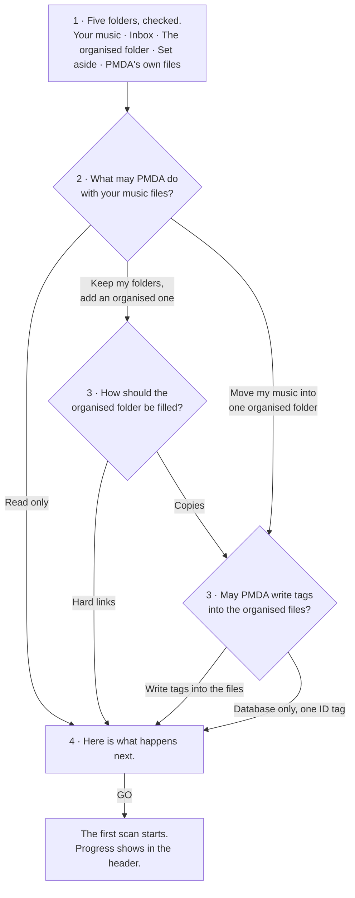

# Setup and settings

From v960. The setup wizard asks one question. Everything it does not ask keeps a
sensible default, and the last screen says where each default lives in Settings. The
words on every settings page are the words the wizard used.

## The wizard: four screens, then the first scan

| Screen | What it does |
|---|---|
| Five folders, checked | PMDA checks the folders you mounted. Nothing to type. A red row shows the exact line to add. |
| What may PMDA do with your music files? | Read only. Keep my folders, add an organised one. Move my music into one organised folder. |
| The follow-up, when the choice needs one | Hard links or copies. Whether tags are written into the organised files. |
| Here is what happens next | One short sentence per fact. A fold lists every setting GO writes. Then GO. |

Read only is three screens. Keep my folders with hard links is four, with copies five.
Move is four.

### The three choices

| Choice | What happens to your files |
|---|---|
| Read only | PMDA reads your music. Not one byte of your files changes. Everything it finds goes into its own database. Duplicates and incomplete albums are found, never moved. |
| Keep my folders, add an organised one | Your files stay where they are. PMDA builds an organised folder beside them, with hard links or copies. Only the music goes into it. Artwork, scans and extras stay with your files. |
| Move my music into one organised folder | The only choice that moves your files. Everything ends up in one organised folder, named and sorted by PMDA. The whole album folder moves: artwork, scans and extras go with the music. |

### What GO writes, and what it keeps

GO writes the choice about files, the export step, how the organised folder is filled and
what is written into it. It never writes a folder path: the five folders come from the
container. Then it schedules the nightly scan and the nightly backup, and starts the
first scan.

| Setting | Default | Where to change it |
|---|---|---|
| Duplicates | found, never moved | Setup › Scan |
| Incomplete albums | found, never moved | Setup › Scan |
| Identities | MusicBrainz, public service, no key | Setup › Sources |
| Discogs, Last.fm, AcoustID | off until you add a free key | Setup › Sources |
| Players | Plex, Jellyfin, Navidrome not connected | Setup › Players |
| Scans | changed folders every 20 minutes, everything on Sunday at 02:00 | Setup › Scan |
| Backups | every night | Server › Backups |
| Notifications | failures only, in the app | Server › Server |
| AI agent access | off | Server › Agents |

## Settings: one page, three groups

A standard account sees You. An admin sees everything, in the order a server is
configured. Every page shows the rows a first-time reader needs; the rest sits under
Advanced, with its default.

| Group | Who | Pages |
|---|---|---|
| You | everyone | Profile, Playing, Concerts, and Shared libraries when another admin shared one |
| Setup | admin | Folders, Files, Sources, Scan, Players, Acquisition, Instant play copy |
| Server | admin | Server, Agents, Users, Backups, Maintenance, Logs & support, Danger zone |

### You

| Page | What is on it |
|---|---|
| Profile | Your picture, what others see, light or dark, the weekly digest, password, two-factor. |
| Playing | Players on your phone and in your car, ListenBrainz, what plays after an album. |
| Concerts | Whose concerts PMDA follows, and how far from home. |

### Setup

| Page | What is on it |
|---|---|
| Folders | The five folders, and what each is for. |
| Files | The wizard's question. Hard links or copies. Tags. Folder names. |
| Sources | MusicBrainz, other sources and their keys, tools PMDA can run, concert dates. |
| Scan | When PMDA scans. Duplicates, incomplete albums, folders to skip, repairs. |
| Players | Plex, Jellyfin, Navidrome, Last.fm, the Spotify app. |
| Acquisition | Lidarr, autobrr, the download webhook. |
| Instant play copy | A small Opus copy on a disk that never sleeps. |

### Server

| Page | What is on it |
|---|---|
| Server | Name, public address, e-mail for invitations, notifications, what is running now. |
| Agents | The MCP key, what an agent may do, what it did. |
| Users | Roles, requests, invitations. |
| Backups | Nightly snapshots, restore. |
| Maintenance | Re-read the tags. Import a trusted folder. |
| Logs & support | One anonymised report to send. |
| Danger zone | Reset the library data. Settings and users stay. |

### Old links

Every former section id still opens its successor: `#settings-pipeline` opens Scan,
`#settings-published-library` opens Files, `#settings-mcp` opens Agents, and
`/settings/user` opens You.

## What changed, in numbers

| | Before | From v960 |
|---|---|---|
| Wizard screens before the scan | 19 to 23 | 3 to 5 |
| Settings pages | 2 pages, 28 entries | 1 page, 17 entries (3 for a standard user) |
| Rows on screen for an admin | about 180 | about 70, the rest under Advanced |
| Longest help sentence | 62 words | 16 words, enforced by a test |
| Names for one mode | three | one, shared by the wizard and every page |
